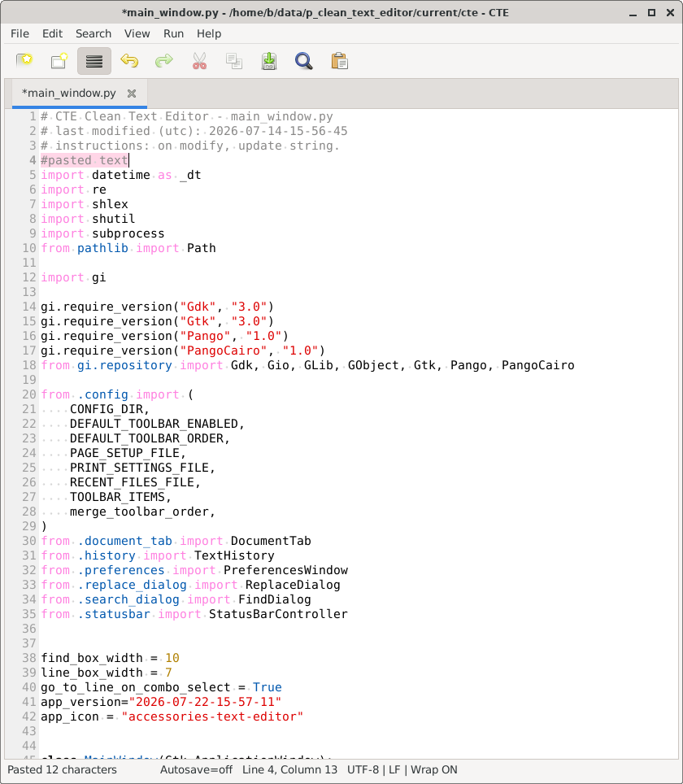

# cte - clean text editor

2026-07-23-12-15-08

cte - clean text editor for xfce and the like envinronment, created using python + gtk3

features:

- simple design
- mark pasted text with color (temporarily)
- simple config
- search and replace dialogs don't pick up random text
- autosave
- regex support for search and replace
- use F2 to add timestamp like this: 2026-07-25-20-17-04

## changes

2026-07-23-12-15-08
- removed 'go to line combo box' from 'toolbar icons on by default'
